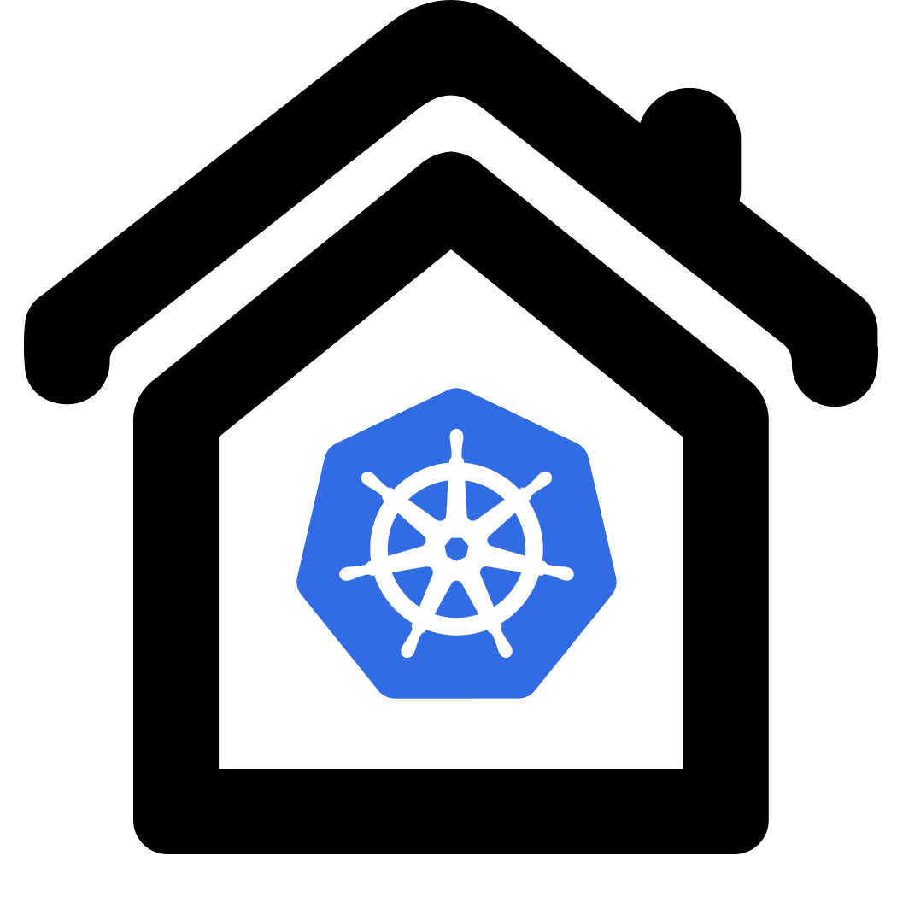

# Kubernetes at home for fun and education

Homekube aims to set up a full operational kubernetes environment on a baremetal Ubuntu server. 
The focus is getting something done first and learn along a happy path while extending your working environment.  

Following this tutorial you should have Kubernetes and a sample application installed 
along with the most useful and popular administration components on your local Ubuntu server:

- [ Kubernetes **Dashboard**](https://dashboard.homekube.org)
- [ **Prometheus** Metrics](https://prometheus.homekube.org)
- [ **Grafana** Monitoring](https://grafana.homekube.org/d/9CWBz0bik/1-node-exporter-0-16-for-prometheus-monitoring-display-board?orgId=1&refresh=1m&from=1590319468858&to=1590924268858&var-interval=5s&var-env=All&var-name=All&var-node=All&var-maxmount=%2F)
- [ Sample **WhoamI** application](https://whoami.homekube.org)

There are many ways to install Kubernetes locally but for simplicity we'll follow Ubuntu's recommended [ **MicroK8s installation recipes**](https://microk8s.io/docs).
Is this really for you ? If you are in doubt read the [considerations](docs/considerations.md) before you start.


The [ MicroK8s docs](https://microk8s.io/docs) 
we'll follow are pretty much straightforward for the first steps.
However I think its fair to say that once you have installed the basics there is very little guidance on how to proceed
 to set up a complete working environment including dashboard, monitoring and a sample app.
If you are already familiar with the concepts and terminology thats not a problem for you because you know how to go ahead.
But hey - for the rest of us this means googling like hell and if you really were familiar with that stuff
you won't be here - won't you ?
Thats where this tutorial jumps in as a leaflet and reference with pointers to further in-depth documents, concepts and resources.

## Basic installation

#### Requirements

Server requirements are:

* An Ubuntu 20.04 LTS (18.04 LTS or 16.04 LTS will do also [or alternatives linux distros supporting snapd](https://snapcraft.io/docs/installing-snapd))
* At least 20G of disk space and 4G of memory are recommended
* An internet connection

#### Prerequisites

Further its assumed that your server is a separate computer. It might be a VM as well but thats beyond the scope of these instructions.
For the purpose of this tutorial it is assumed that

1) Your homenet is in the portrange `192.168.1.0 - 192.168.1.255` (A class C subnet 192.168.1.0/24) 
2) Your servers ip is static `192.168.1.100` and the username is `mykube`
3) You have a free range of unassigned ips that are excluded from your routers dhcp address range.
We will use these addresses to substitute the functionality of a cloud providers LoadBalancer for all your incoming traffic.
These addresses may not be used by any other device in your network. Here we assume this (randomly chosen) 
portrange is 
`192.168.1.200-192.168.1.220`  
You'll need a minimum of 5 IPs but its better to have some headroom for extensions and your own exercises. 

Of course you can choose whatever is appropriate for your environment as long as you modify the commands accordingly.
  
Open a terminal on your computer and connect to your server 
```bash
ssh mykube@192.168.1.100
```

Its recommended to fork the repo on github and clone your fork to your server.
This way you might save all your local changes or additions to your own repo and if you notice errors
or suggest improvements you might easily sumbit a PR to improve homekube. 

```bash
# Recommended
git clone git@github.com:<your clone>/homekube.git

# Alternative
git clone git@github.com:a-hahn/homekube.git
```

---
Then follow the [ **steps 1-3** in the Microk8s tutorial](https://microk8s.io/docs).
At this point you are done with a base installation and this tutorial will lead you through the next steps of installing the other apps.

TL;DR:

```bash
sudo snap install microk8s --classic --channel=1.18/stable
sudo usermod -a -G microk8s $USER
sudo chown -f -R $USER ~/.kube
su - $USER
microk8s status --wait-ready
```
Add an alias for `kubectl` to reduce our typing by appending `~/.bash_aliases` with  
`alias kubectl='microk8s kubectl'`  
and activate it instantly `. ~/.bash_aliases`

---
Finally in your terminal window execute

```bash
kubectl version --short
```

The response will be something like
```
Client Version: v1.18.2-41+b5cdb79a4060a3   
Server Version: v1.18.2-41+b5cdb79a4060a3
```
Congrats ! You are done with the first part.

## Enable Add-Ons

Next we will enable a couple of add-ons. The MicroK8s tutorial lists a [ couple of add-ons](https://microk8s.io/docs/addons)
but explanations are rather short and we will only install basic components so that the setup comes close to a base cloud setup.

```bash
microk8s enable dns storage rbac helm3
```
More [ about AddOns ...](docs/microk8s-addons.md) 

## Next steps

Lets proceed installing the [ kubernetes dashboard](docs/dashboard.md)    
  
[](https://dashboard.homekube.org/#/login "Thats the live dashboard you'lll install on your own server")

