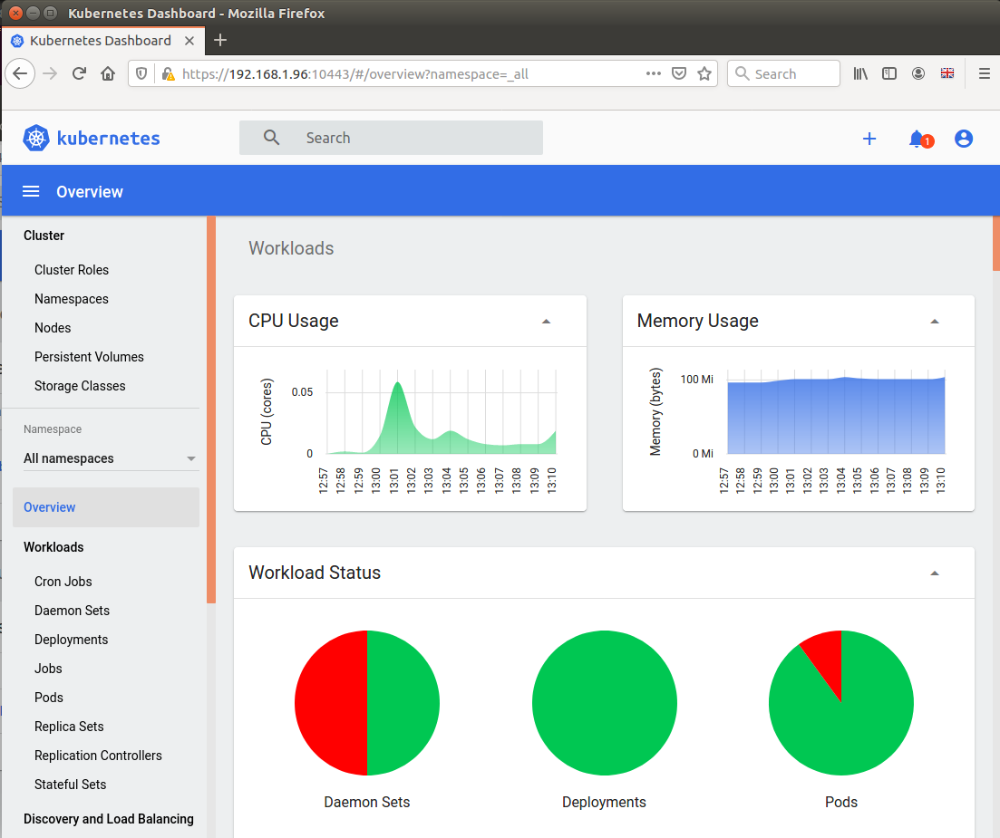

# Dashboard

We do not use the MicroK8s dashboard installation manifests for a 
[ couple of reasons](dashboard-background.md) .
In case its already installed we will **disable** it first.

``
microk8s disable dashboard
``

Instead we simply install the upstream 
[ community version](https://github.com/kubernetes/dashboard#kubernetes-dashboard)

```bash
kubectl apply -f https://raw.githubusercontent.com/kubernetes/dashboard/v2.0.1/aio/deploy/recommended.yaml
```

Lets quickly check the installation. `192.168.1.100` is our server ip when following the prerequisites.

```bash
kubectl port-forward -n kubernetes-dashboard service/kubernetes-dashboard 10443:443 --address 0.0.0.0
``` 
Port-forward is just a temporary solution for development. When the session is terminated the port is no longer accessible.
Alternatively you might prefer a 
[ permanent solution.](dashboard-background.md#exposing-dashboard) .

In your **local browser open `https://192.168.1.100:10443`**

A warning about an untrusted certificate will show up and upon confirmation **in Firefox**
you'd see the dashboards sign-in page. This may not work for you. 
[ Read why and troubleshoot ...](dashboard-background.md#troubleshoot-certificates) 
 


We will create appropriate [ certificates ](cert-manager.md)
with LetsEncrypt later and install them in the [ Ingress](ingress.md) part of this tutorial.

For login we create two users. One that has full admin rights and one with restricted rights.  
The [ Create sample user docs](https://github.com/kubernetes/dashboard/blob/master/docs/user/access-control/creating-sample-user.md)
provide some more details about that. Here is the short path:

```bash
cd ~/homekube/src/dashboard
kubectl apply -f create-admin-user.json
kubectl apply -f create-simple-user.json
```
These manifests create the required 
[ `clusterrolebindings` `serviceaccounts` and their `secrets`](https://kubernetes.io/docs/reference/access-authn-authz/rbac/). Now we inspect the created secrets (account tokens) 
[ manually](dashboard-background.md#get-token) or execute the script:

```bash
name=simple-user # or 'simple-user'
namespace=kubernetes-dashboard
token=$(kubectl -n $namespace get secret | grep ${name}-token | cut -d " " -f1)
kubectl -n $namespace describe secret $token 
``` 
From the output copy the `token:` **encrypted secret** in the DATA section (with a double click) to the clipboard and paste it
into `Enter token *` input field and sign in.

```text
Name:         simple-user-token-nj2qx
Namespace:    kubernetes-dashboard
Labels:       <none>
Annotations:  kubernetes.io/service-account.name: simple-user
              kubernetes.io/service-account.uid: 0a08fec3-c8dc-4ec2-ae87-bb1ff53b01c3

Type:  kubernetes.io/service-account-token

Data
====
namespace:  20 bytes
token:      eyJhbGciOiJSUzI1NiIsImtpZCI6InVZXzVvdmtBUnp4bmpaczdlVXdLWkhkU3U0QzZReTY1U3ZydlpNWTVqMjgifQ.eyJpc3MiOiJrdWJlcm5ldGVzL3NlcnZpY2VhY2NvdW50Iiwia3ViZXJuZXRlcy5pby9zZXJ2aWNlYWNjb3VudC9uYW1lc3BhY2UiOiJrdWJlcm5ldGVzLWRhc2hib2FyZCIsImt1YmVybmV0ZXMuaW8vc2VydmljZWFjY291bnQvc2VjcmV0Lm5hbWUiOiJzaW1wbGUtdXNlci10b2tlbi1uajJxeCIsImt1YmVybmV0ZXMuaW8vc2VydmljZWFjY291bnQvc2VydmljZS1hY2NvdW50Lm5hbWUiOiJzaW1wbGUtdXNlciIsImt1YmVybmV0ZXMuaW8vc2VydmljZWFjY291bnQvc2VydmljZS1hY2NvdW50LnVpZCI6IjBhMDhmZWMzLWM4ZGMtNGVjMi1hZTg3LWJiMWZmNTNiMDFjMyIsInN1YiI6InN5c3RlbTpzZXJ2aWNlYWNjb3VudDprdWJlcm5ldGVzLWRhc2hib2FyZDpzaW1wbGUtdXNlciJ9.jbbY-5fzz7Sh7ogyxh1-mwvrRo_ybLeSfh8-6gnhe2TQt63DE0BWJ2P8YNmvq5EZsdLpMhta1tPj7YJpvqEDR0ppF0LmLd5BXL4SnN13SeMsYRe8w1NLO3M0hhDt9znzZvos5EhKFrOzI-REbObVg7H8W4c69TxVEb-GGBfQkSFjkGW3vqMibRYIQubvC563Cfc337ROJ5IMc6OIrgzVI4WR7v2gHJyzH3gzBx8Hs2NXqATdsYl6qWUKu-i9_4jKSkJxhtn1nzCdSHTs6t1TEQ-xKjwPNDrtcwvlNp-GwE0m2oYl-l9IH0okS97wdVqJmmNDHmddDXxBf-WrE2ShVQ
ca.crt:     1103 bytes

```

**Congrats !!** The dashboard is up and running and exposed as a service !!



Now try the other token that we created for `simple-user` as well. The simple user has restricted rights. For example
he can't view any secrets.

If you want to repeat the steps as an exercise
[ cleanup first](dashboard-background.md#cleanup).

## Next steps

Lets improve the dashboard access via 
[ Ingress](ingress.md).
