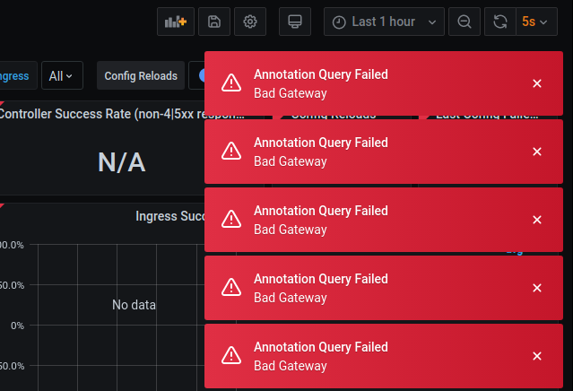

# Notes

Grafanas helm chart offers so many configuration options and its not easy to keep track of them all.
Many options exclude each other and it is not immediately obvious.

For a deeper dive the helm charts
[  values.yaml](https://github.com/helm/charts/blob/master/stable/grafana/values.yaml)
is a highly recommended read. As with all helm charts this chart is installed by default before all other
customizations are installed.

Depending on the installation settings this chart also deploys `sidecars` e.g. helper containers that are responsible
for downloading dashboards.

Here are some installation snippets for the record which support installation of dashboards with a **ConfigMap**.
However this incompatible with configuring installation of dashboards from the grafana website in the same 
installation script. (`dashboards` - section in `datasource-dashboards.yaml` must be omitted [as in `values.yaml`]) 

```bash
# works only with 
# -- set sidecar.dashboards.enabled=true

#kubectl -n grafana create cm grafana-dashboard-nginx-performance --from-file=dashboards/nginx-request-handling-performance-2m.json
#kubectl -n grafana label cm grafana-dashboard-nginx-performance grafana_dashboard=nginx-performance

#kubectl -n grafana create cm grafana-dashboard-nginx --from-file=https://raw.githubusercontent.com/kubernetes/ingress-nginx/master/deploy/grafana/dashboards/nginx.json
#kubectl -n grafana label cm grafana-dashboard-nginx grafana_dashboard=nginx

```

## Troubleshooting

### Grafana pod not starting

Unfortunately there is not always a very useful error message available. But there are a couple of common problems to track first.

#### Pod keeps pending forever
Watching pod status `kubectl get po -n grafana --watch` keeps pending state:
```text
NAME                       READY   STATUS    RESTARTS   AGE
grafana-7bc8fcd968-8d87b   0/1     Pending   0          46s
```
Describing pod `kubectl describe po -n grafana` gives lots of details. Read the tail `Events` first:
```text
...
Events:
  Type     Reason            Age                From               Message
  ----     ------            ----               ----               -------
  Warning  FailedScheduling  14s (x3 over 75s)  default-scheduler  running "VolumeBinding" filter plugin for pod "grafana-7bc8fcd968-8d87b": pod has unbound immediate PersistentVolumeClaims
```
Double check storage class name and if the claimed storage is available. Test the [ nfs storage provider](nfs.md#testing) for availability.

#### Pod keeps crash-looping
Watching pod status `kubectl get po -n grafana --watch` keeps crash looping:
```text
NAME                       READY   STATUS       RESTARTS   AGE
grafana-7bf7ff8644-p6ttj   0/1     Init:Error   0          5s
grafana-7bf7ff8644-p6ttj   0/1     Init:1/2     1          6s
grafana-7bf7ff8644-p6ttj   0/1     Init:Error   1          7s
grafana-7bf7ff8644-p6ttj   0/1     Init:CrashLoopBackOff   1          8s
grafana-7bf7ff8644-p6ttj   0/1     Init:1/2                2          21s
grafana-7bf7ff8644-p6ttj   0/1     Init:Error              2          22s
grafana-7bf7ff8644-p6ttj   0/1     Init:CrashLoopBackOff   2          36s
```

A typical reason for this error scenario is that the grafana can't load the required dashboards. If only one dashboard cannot be loaded startup will fail.
From the `datasource-dashboards.yaml` in the `dashboard` section remove one by one and reinstall. This is a sample configuration with only one dashboard:
```yaml
...
dashboards:
  prometheus:
    grafana-node-exporter:
      # Ref: https://grafana.com/dashboards/11207
      gnetId: 11207
      datasource: Prometheus
```

### Grafana 'Bad Gateway'

If Grafana is up and running but you don't see any metrics



In this case the data flow from prometheus to grafana is not properly configured or does not work. Possible reasons are
- Prometheus is not installed. -> Check [ Prometheus](prometheus.md)
- DNS not enabled. We enabled `microk8s enable dns ...` during the first installation steps.  
Check its availability `microk8s status`.  
If DNS is enabled follow the [ Debugging DNS resolution](https://kubernetes.io/docs/tasks/administer-cluster/dns-debugging-resolution/)  
In still not succesfull check the ClusterIp of the prometheus-server `kubectl get svc -n prometheus`:
```text
NAME                            TYPE        CLUSTER-IP       EXTERNAL-IP   PORT(S)    AGE
prometheus-kube-state-metrics   ClusterIP   10.152.183.197   <none>        8080/TCP   47h
prometheus-node-exporter        ClusterIP   None             <none>        9100/TCP   47h
prometheus-server               ClusterIP   10.152.183.235   <none>        80/TCP     47h
```
In this example its `10.152.183.235`. Now edit `datasource-dashboards.yaml` and replace in the `datasource` section:  
`url: http://prometheus-server.prometheus` with `url:http://10.152.183.235`.  
**NOTE** that this temporary fix needs to be checked each time Prometheus is reinstalled.

### Installation response message

Sometimes helms install repsonse messages are not accurate. 
Just as with regular configuration templates the response is under full
control of the chart developers and its output is rendered by 
[  NOTES.txt](https://github.com/helm/charts/blob/master/stable/grafana/templates/NOTES.txt).  
In charts with many configuration options it can be challenging to render a proper response message. In this case
the `admin.existingSecret` and its other variables are not considered. 
It should either not be prompted because credentials are provided or it should read  
```bash
kubectl get secret --namespace grafana grafana-creds -o jsonpath="{.data.admin-password}" | base64 --decode ; echo
```
