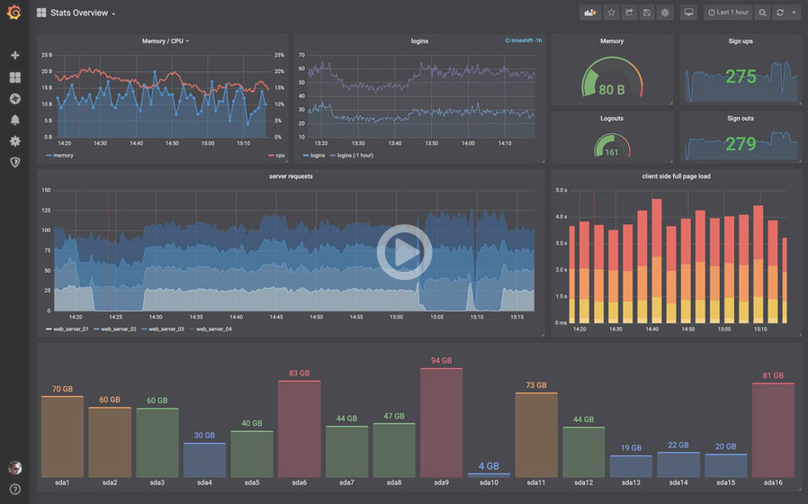
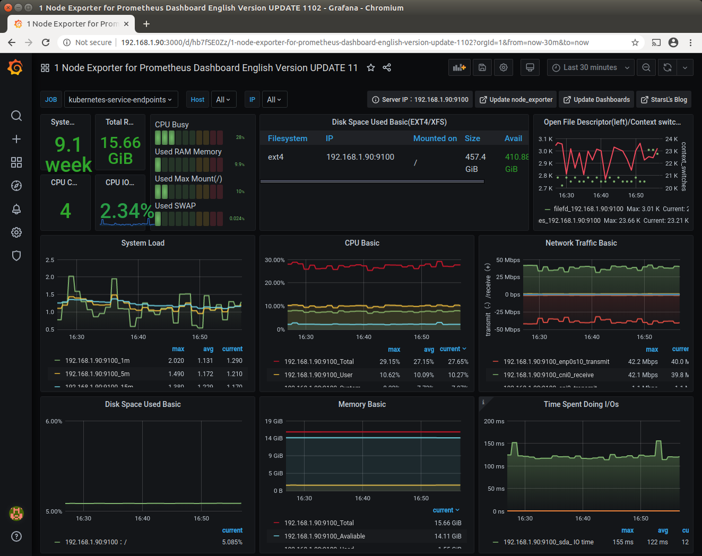

# Grafana

What is Grafana ? From their homepage 
[ grafana.com](https://grafana.com) :  

> Used by thousands of companies to monitor everything from infrastructure, applications, and power plants to beehives.

They have an online demo to browse and play:
[](https://play.grafana.com)

## Preparation

Prerequisites are: 
- [ Prometheus](prometheus.md) for data aquisition / scraping
- [ Helm](helm.md) (already installed for Prometheus)
- A storage provisioner to fullfill storage claims (e.g. 
[ NFS Storage](nfs.md)) (already installed for Prometheus)

## Installation

Grafana installation and configuration involves a couple of steps and there are multiple ways to do it.

- install grafana and its components
- configuring datasource(s) and provider(s)
- installing dashboards

In many cases you may want to only install the basic grafana and then configure/install datasources and dashboards
through the Grafana ui. There are so many options from very easy to very complex and there is also a 
[ public catalog of dashboards](https://grafana.com/grafana/dashboards).

These installation steps try to keep the manual effort as low as possible and 
will install some dashboards known to work in the context of this tutorial. We will use the
[  stable/grafana](https://github.com/helm/charts/tree/master/stable/grafana)
chart.

```bash
cd ~/homekube/src/grafana

kubectl create namespace grafana

# provide default admin credentials e.g. admin/admin1234
kubectl create secret generic grafana-creds -n grafana \
  --from-literal=admin-user=admin \
  --from-literal=admin-password=admin1234

helm install grafana -n grafana --version=5.3.3 \
-f datasource-dashboards.yaml \
--set persistence.enabled=true \
--set persistence.storageClassName=managed-nfs-storage \
--set admin.existingSecret=grafana-creds \
stable/grafana
```

Actually a lot of configuration details are "hidden" in the `datasource-dashboards.yaml`. See the comments there.
We enable persistence and set a storage class. We also provide credentials of our choice for the admin user. 

Installer response:

```text
NAME: grafana
LAST DEPLOYED: Thu Jul 16 09:09:40 2020
NAMESPACE: grafana
STATUS: deployed
REVISION: 1
NOTES:
1. Get your 'admin' user password by running:

   kubectl get secret --namespace grafana grafana -o jsonpath="{.data.admin-password}" | base64 --decode ; echo

2. The Grafana server can be accessed via port 80 on the following DNS name from within your cluster:

   grafana.grafana.svc.cluster.local

   Get the Grafana URL to visit by running these commands in the same shell:

     export POD_NAME=$(kubectl get pods --namespace grafana -l "app.kubernetes.io/name=grafana,app.kubernetes.io/instance=grafana" -o jsonpath="{.items[0].metadata.name}")
     kubectl --namespace grafana port-forward $POD_NAME 3000

3. Login with the password from step 1 and the username: admin
```

Before we follow the installers instructions lets first check if the installation was successful.
```bash
kubectl get po -n grafana --watch
```
Depending on the number of pre-configured dashboards it can take quite a while 
until all the dashboards are configured and grafana shows **STATUS Running**:
 
```text
NAME                       READY   STATUS    RESTARTS   AGE
grafana-6cb8cb8f8f-gtbl6   1/1     Running   0          22m
```
If you see `STATUS CrashLoopBackoff` or another status for some time then consult the
[ troubleshooting tips](grafana-notes.md#troubleshooting).

Lets follow the installers instructions:
1) Get your 'admin' user password ...  
We **can ignore this** because the password was already supplied in the `kubectl create secret ...` instruction.
Unfortunately the prompted command
specifies a wrong secret name. See the 
[ background info](grafana-notes.md#troubleshooting).
2) Execute the instructions but note the appended **--address=0.0.0.0**   
```bash
export POD_NAME=$(kubectl get pods --namespace grafana -l "app.kubernetes.io/name=grafana,app.kubernetes.io/instance=grafana" -o jsonpath="{.items[0].metadata.name}")
kubectl --namespace grafana port-forward $POD_NAME 3000 --address=0.0.0.0
```  
Next open a browser on **http://192.168.1.100:3000** login and explore the grafana dashboard.

In the topmost bar click on `Home` and from the selection pick  
**1 Node Exporter for Prometheus Dashboard English Version**



## Cleanup

In case you want to remove the installation (e.g. reinstall ....)

```bash
helm uninstall grafana -n grafana
kubectl delete namespace grafana
helm list --all-namespaces
```

## Next steps

Browse and check the options of your grafana dashboard. Then you might want to explore the 
[ workload behaviour of your cluster](workload-testing.md).

## Tutorials

 - [  34:09 Prometheus monitoring for Kubernetes Cluster and Grafana visualization](https://www.youtube.com/watch?v=CmPdyvgmw-A)  
 [[Just me and Opensource](https://www.youtube.com/channel/UC6VkhPuCCwR_kG0GExjoozg)] 
