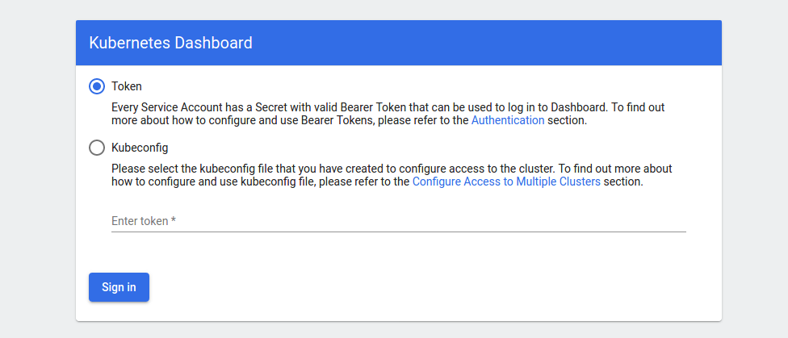

# Ingress and MetalLb

Ingress is a very useful component for having a common entrypoint for multiple services.
We will use [ Ingress](microk8s-addons.md#ingress)
together with [ MetalLb](https://metallb.universe.tf) 
which serves as a replacement for cloud-based LoadBalancers. In a typical cloud environment all incoming
traffic will flow into a kubernetes cluster from the LoadBalancer and MetalLb is a compatible 
replacement for non-cloud installations.

Data flow will be

```
                             Nginx      Dashboard
Internet -> LoadBalancer ->  Ingress -> service 
```

## Preparation

```bash
cd ~/homekube/src/ingress
```
A ``pwd`` should now show something like `/home/mykube/k8s/ingress`.  
Make sure you have installed [ Helm](helm.md) before you proceed.

## Installation

We will setup own namespaces for metallb and ingress-nginx to allow an easier maintenance later.
Microk8s default installation tends to install many add-ons in the 'kube-system' namespace. 
That makes it harder later if it turns out that the default installation needs to be modified or extended.

```bash
kubectl create namespace metallb-system
kubectl apply -f metallb-config.yaml
helm install metallb --namespace metallb-system stable/metallb
```
These commands are a helm based replacements for microk8s LoadBalancer enablement `microk8s enable metallb`.
If you need to reconfigure the default portrange `192.168.1.200-192.168.1.220` please
edit `metallb-config.yaml` to match your environment.

Next we'll install ingress-nginx. The notable difference to `microk8s enable ingress` is that this configuration 
prepares ingress for later usage of scraping metrics and provide some traffic visualisation.
That wasn't easy to extend when using microk8s version.
  
```bash
kubectl create namespace ingress-nginx
helm install nginx-helm -n ingress-nginx -f ingress-helm-values.yaml ingress-nginx/ingress-nginx
```

## Configuration

Next we configure the dashboard service. If you have already configured Apache2 or Nginx reverse proxies 
this may be a bit familiar for you. The manifest type is `Ingress` and 
the noticeable difference is that configuration is done through annotations.
Read more about
[ Ingress configuration](https://kubernetes.io/docs/concepts/services-networking/ingress/).  
There is a long list of 
[ available annotations](https://kubernetes.github.io/ingress-nginx/user-guide/nginx-configuration/annotations/).
Reference of
[ embedded variables](http://nginx.org/en/docs/http/ngx_http_core_module.html#variables)

We accept https incoming traffic unwrap it and wrap it again in https to forward it to the kubernetes dashboard.
It is an important detail that the  **Ingress manifest must be defined in the same namespace as the service it references** 
e.g.  `namespace: kubernetes-dashboard` .

```bash
cd ~/homekube/src/dashboard
kubectl apply -f ingress-dashboard.yaml
```
In your **local browser open `https://192.168.1.200`**  
Dashboard now opens via Ingress in addition to the previous configuration. 



Note that we did not provide a certificate so far. 
Ingress will present your browser a `Kubernetes Ingress controller Fake Certificate`
certificate that is different from the one presented by the dashboard service and 
the default dashboard certificate. Although Chrome again shows the  `NET::ERR_CERT_AUTHORITY_INVALID`
error it will now show a `Proceed to 192.168.1.200 (unsafe)` option.

## Next steps

Lets improve the dashboard and remove the annoying
[ token login](dashboard-1.md). 
