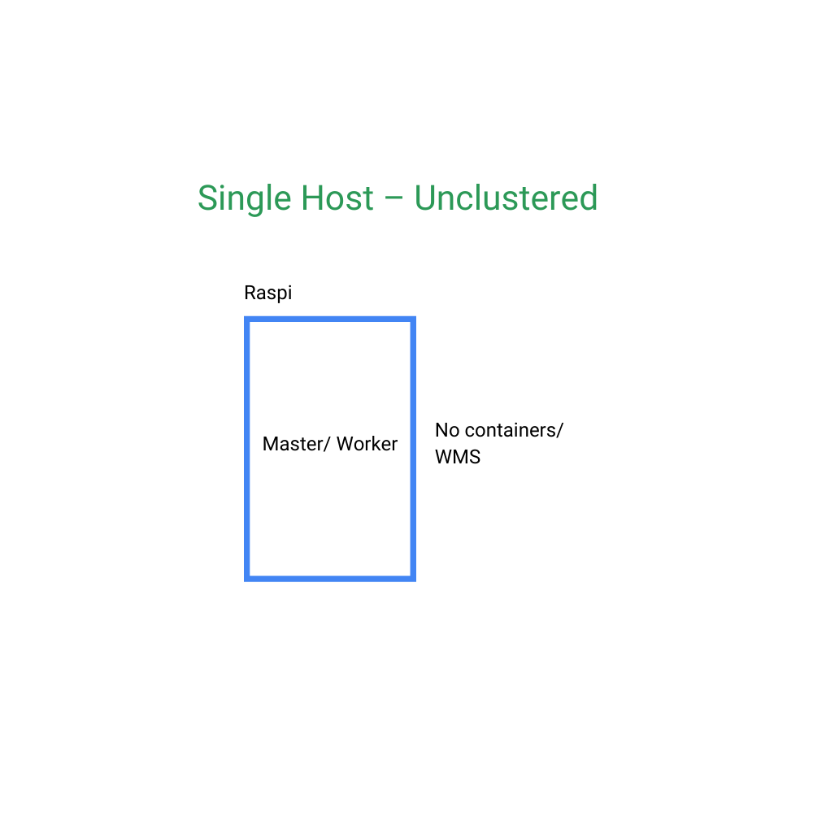
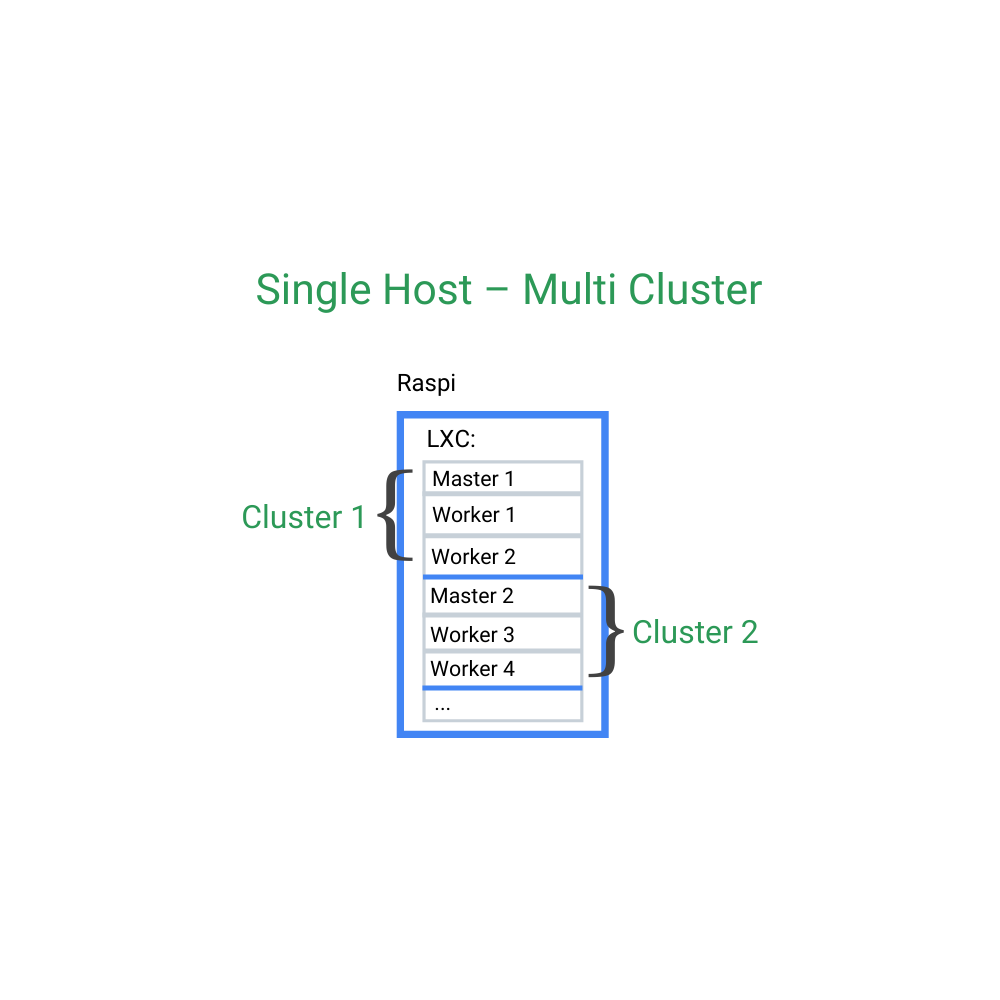
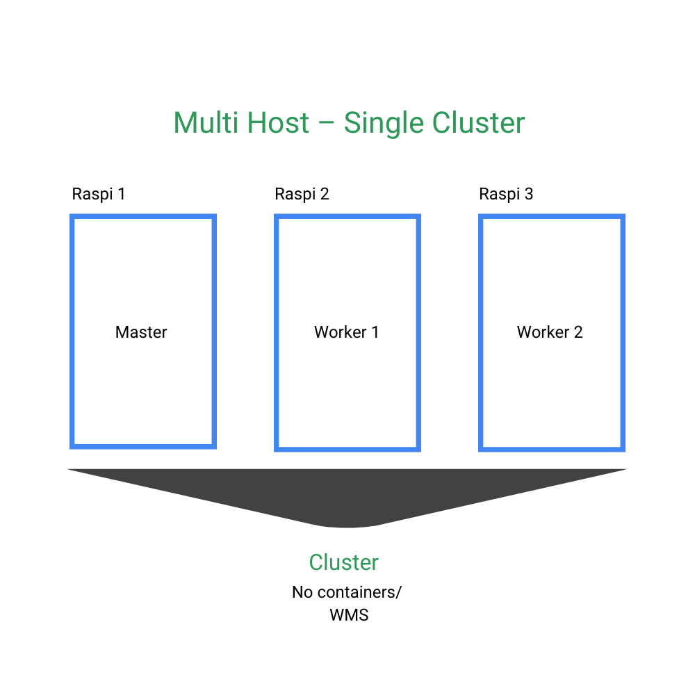
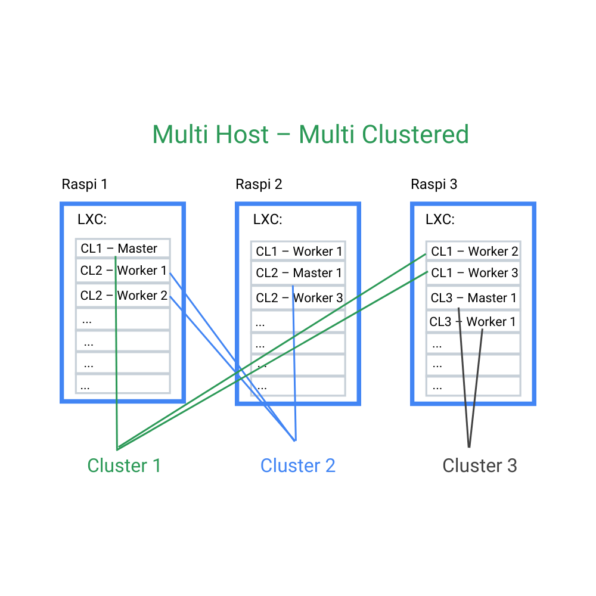

# Overview of installation variants

from simple to sophisticated

## Single host

| | Single node | Containerized |
|---|-------------|-----------|
| | | |
| + | Simple installation | 2 or more independent nodes possible |
| - | Limited options (only one node) | Requires containers / VMs |
| | [  25:24 Basic single node installation of kubernetes on Raspberry Pi](https://www.youtube.com/watch?v=Gir3XTeIzFk) | [  42:21 Installing a kubernetes cluster on Raspberry Pi](https://www.youtube.com/watch?v=G91wlOAsW00)  |

[  23:07 Verify your installation using the dashboard and a simple helm chart](https://www.youtube.com/watch?v=1I97auLOarg)

## Multiple hosts

| | Single Cluster | Containerized Multi Clustered |
|---|-------------|-----------|
| | | |
| + | <ul><li>Medium complex installation</li><li>Requires setup of bridges but its similar to single host</li></ul>  | Most efficient use of hardware  |
| + |  | Allows high availability deployments independent of hw failures  |
| - | Not the most efficient use of hardware |  |
|  |  Just repeat the installation steps for a single host | [  27:45 More Raspberries - more challenges. Install a multi host - multi cluster Raspberry Pi 'farm'](https://www.youtube.com/watch?v=VI9YGBLEEew)  |

# Chosing a variant

Chosing variants is a trade-off between installation complexity and flexibility.
We will focus for now on single node containerized installations.

## Chosing a virtualization environment

There are a couple of choices for virtualization environment.
Virtual machines offer the best isolation but they have a much larger footprint than containerized solutions.
Most popular containers are Docker and LCX/LXD (linux container) based solutions.
Docker is smart and widespread but kubernetes support of Docker in future version is deprecated
and linux containers exist for a long time
and are very mature. Even better they are already preinstalled on recent Ubuntu installations so this choice
is pretty easy and straightforward.

However you need to be aware that initial setup can be pretty tricky. The reason is that in contrast to VMs 
containers are not allowed to load kernel modules on demand so it is necessary to provide all kernel modules
already on startup. Another challenge is container security. In Linux environments usually AppArmor cares
about isolation. This setup needs to be configured properly or you might run into all cases of weird application
glitches difficult to trace. Luckily there is a good (but short) 
[ documentation by Canonical](https://microk8s.io/docs/lxd) and some more
background information follows here.

## Chosing a networking strategy

How should our containers be accessible from the outside world and what security concerns need to be addressed ?

By default LXC containers install their own isolated bridge (lxdbr0) and cannot be reached from your local net.
Thats not very useful for most situations as it usually requires more individual configuration efforts later.

This table shows the configuration options for the different dataflows:

| Source | Destination | Default | Macvlan | Host bridge | 
|------|----|---|----|----|
|Host| Any container| yes| no | yes|
|Local network| Any container| no| yes | yes|
|Any container| Host| no| yes| yes|
|Any container| local network| no| yes| yes|
|Any container| Any container| yes| yes| yes|

> **IMPORTANT !!**
> There are certain restictions if your host is connected to a wireless network (e.g. notebook).  
> This blogpost explains
[**reasons and options** and  setup of a macvlan interface](https://blog.simos.info/how-to-make-your-lxd-container-get-ip-addresses-from-your-lan/)

As you can see from the table a host bridge provides the most flexibility and the default lxdbr0 is basically pretty
useless for most use cases. A good option however is use of a macvlan as it is easy to install and it provides
basically all the necessary features for accessibility in a local network.

## Install MicroK8s in LXC using Macvlan

Now lets proceed with [Homekubes default installation](inst_microk8s-lxc-macvlan.md)
