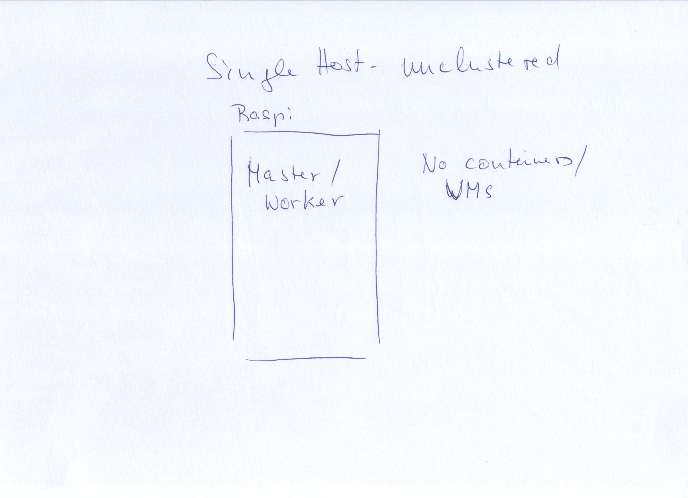
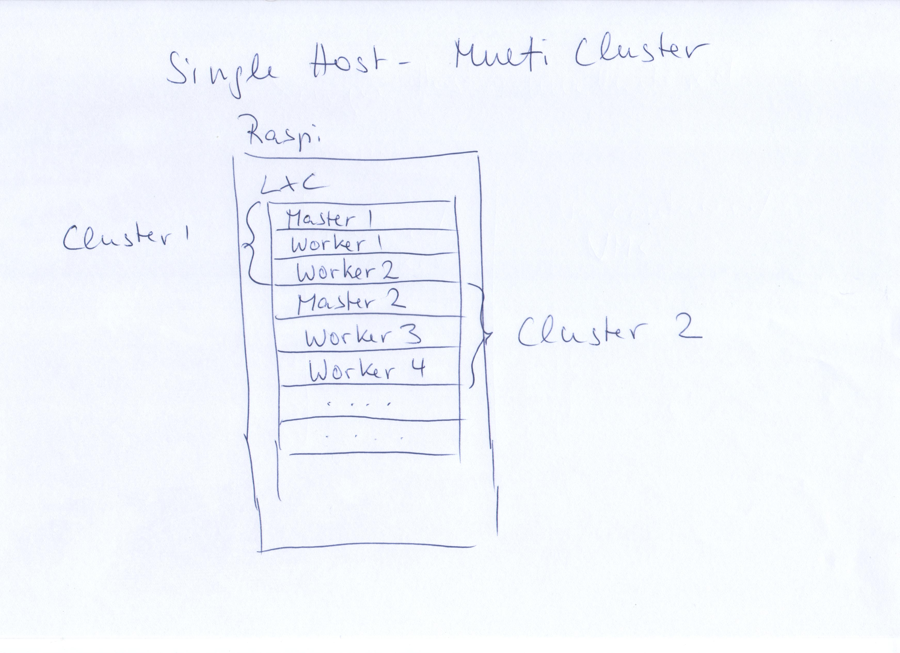
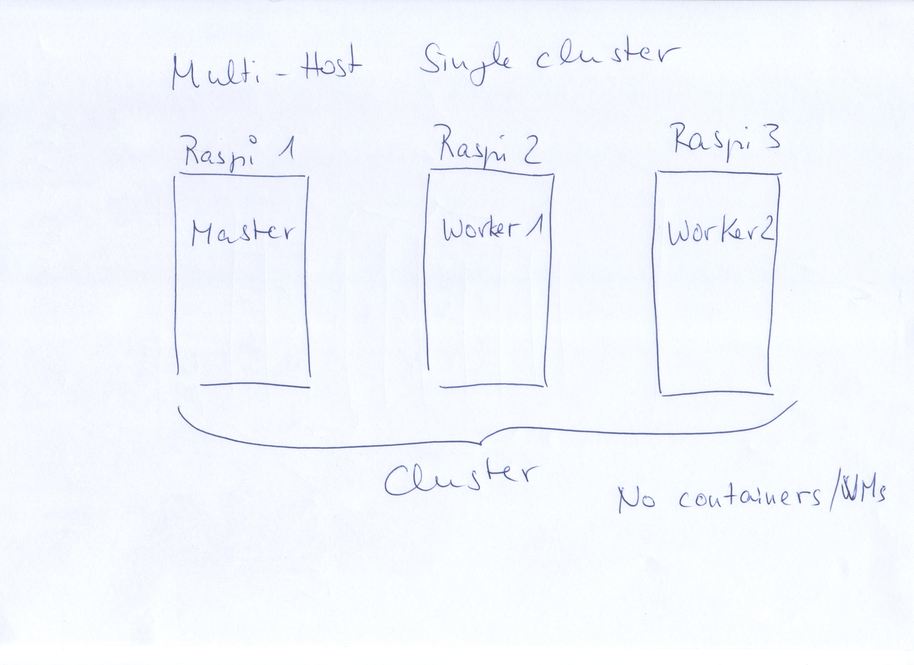
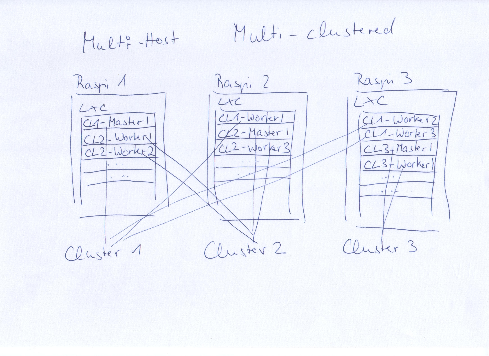

# Chosing a variant

from simple to sophisticated

## Single host

| | Single node | Clustered |
|---|-------------|-----------|
| | | |
| + | Simple installation | 2 or more independent clusters possible |
| - | Limited options | Requires containers / VMs |

## Multiple hosts

| | Single Cluster | Multi Clustered |
|---|-------------|-----------|
| | | |
| + | <ul><li>Medium complex installation</li><li>Requires setup of bridges but its similar to single host</li></ul>  | Most efficient use of hardware  |
| - | Not the most efficient use of hardware | Requires bridges + containers / VMs |

