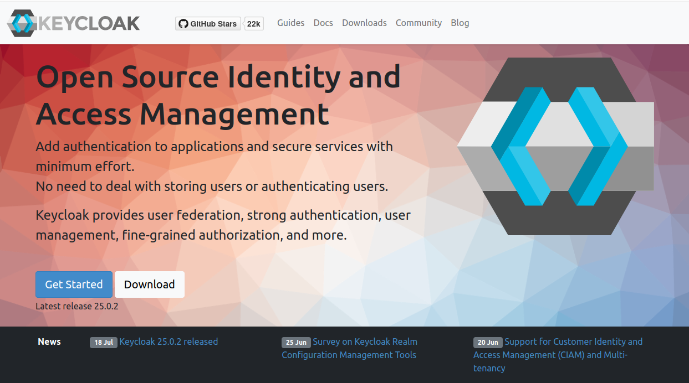

# Keycloak Identity and Access Management

Keycloak is a very powerful and well established solution for providing IAM solutions for all kind of services.  

[](https://www.keycloak.org)

## Preparation

Requirements are:

- [ Postgres database](postgres.md) 

## Installation

As a postgres admin we create a keycloak user and role and the keycloak database  

```bash
cd ~/homekube/src/keycloak
envsubst < create-keycloak.sql | kubectl exec postgres-0 -i -n postgres -- psql -U admin -d postgres
```

You should be able to log into the keycloak database as the keycloak user and list the content:

```bash
root@homekube:~/homekube/src/keycloak# kubectl exec postgres-0 -it -n postgres -- psql -U keycloak -d keycloak
psql (16.3 (Debian 16.3-1.pgdg120+1))
Type "help" for help.

keycloak=> \l
                                                      List of databases
   Name    | Owner | Encoding | Locale Provider |  Collate   |   Ctype    | ICU Locale | ICU Rules |    Access privileges    
-----------+-------+----------+-----------------+------------+------------+------------+-----------+-------------------------
 homekube  | admin | UTF8     | libc            | en_US.utf8 | en_US.utf8 |            |           | 
 keycloak  | admin | UTF8     | libc            | en_US.utf8 | en_US.utf8 |            |           | =Tc/admin              +
           |       |          |                 |            |            |            |           | admin=CTc/admin        +
           |       |          |                 |            |            |            |           | keycloak_role=CTc/admin
 postgres  | admin | UTF8     | libc            | en_US.utf8 | en_US.utf8 |            |           | 
 template0 | admin | UTF8     | libc            | en_US.utf8 | en_US.utf8 |            |           | =c/admin               +
           |       |          |                 |            |            |            |           | admin=CTc/admin
 template1 | admin | UTF8     | libc            | en_US.utf8 | en_US.utf8 |            |           | =c/admin               +
           |       |          |                 |            |            |            |           | admin=CTc/admin
(5 rows)

keycloak=> \q
root@homekube:~/homekube/src/keycloak#
```

Now lets complete the installation. During initial setup all keycloak tables will be created automatically.
Lets execute the installation script.  
**Reminder** to (modify and) set [environment variables first](../src/homekube.env.sh) !


```bash
set -a
. ../homekube.env.sh # set your env vars with the -a option
root@homekube:~/homekube/src/keycloak# . ./install.sh
```

Initial setup takes a while. Be patient.
On successful installation your keycloak namespace should look like:

```bash
root@homekube:~/homekube/src/keycloak# kubectl get all -n keycloak
NAME                            READY   STATUS    RESTARTS   AGE
pod/keycloak-74dd784dd9-xjld2   1/1     Running   0          17h

NAME               TYPE        CLUSTER-IP       EXTERNAL-IP   PORT(S)    AGE
service/keycloak   ClusterIP   10.152.183.153   <none>        8080/TCP   2d1h

NAME                       READY   UP-TO-DATE   AVAILABLE   AGE
deployment.apps/keycloak   1/1     1            1           2d1h

NAME                                  DESIRED   CURRENT   READY   AGE
replicaset.apps/keycloak-74dd784dd9   1         1         1       2d1h
```

Check that keycloaks tables have been created

```bash
psql (16.3 (Debian 16.3-1.pgdg120+1))                                                                                                                                                                                                            
Type "help" for help.                                                                                                                                                                                                                            
                                                                                                                                                                                                                                                 
keycloak=> \dl                                                                                                                                                                                                                                   
      Large objects                                                                                                                                                                                                                              
 ID | Owner | Description                                                                                                                                                                                                                        
                     List of relations                                                                                                                                                                                                           
 Schema |             Name              | Type  |  Owner   
--------+-------------------------------+-------+----------
 public | admin_event_entity            | table | keycloak
 public | associated_policy             | table | keycloak
 public | authentication_execution      | table | keycloak
 public | authentication_flow           | table | keycloak
 public | authenticator_config          | table | keycloak
 public | authenticator_config_entry    | table | keycloak
 public | broker_link                   | table | keycloak

...

\q
```

Now lets check if we are able to open the keycloak admin ui. It should be available as specified in the [keycloak ingress](../src/keycloak/ingress.yaml) definition
**keycloak.${HOMEKUBE_DOMAIN}** e.g. https://keycloak.auth.homekube.org  

Username: **admin**  
Password: **${HOMEKUBE_KEYCLOAK_PASSWORD}**

Now you can proceed with the [configuration](keycloak-configuration.md).

## Inspection and Deinstallation

If you are curious then have a deeper look into your database. 
Here is a list of commands of the [psql command line tool](https://www.postgresql.org/docs/current/app-psql.html) 
Be careful. Its easy to riun the installation.

```
kubectl exec postgres-0 -it -n postgres -- psql -U admin -d postgres
```

Drop DB and users
```
envsubst < drop-keycloak.sql | kubectl exec postgres-0 -i -n postgres -- psql -U admin -d postgres
```

## Backup and restore

Use a helper psql client:

```bash
kubectl run -it postgres-client --image=postgres:16 --restart=Never -- bash
```

### Backup 
```bash
pg_dump -f /tmp/keycloak.backup --host <from-host-ip> --port "30100" --username "keycloak" --format=c -v keycloak
```

### Restore
```bash
psql -U admin -d postgres -c "drop database keycloak;"
psql -U admin -d postgres -c "create database keycloak;"
pg_restore -d keycloak /tmp/keycloak.backup --host <to-host-ip> --port "30100" --username "admin" --format=c
```

### Backup from inside postgres container

```bash
# step into postgres container
kubectl exec postgres-0 -it -n postgres -- bash

# dump the database to /tmp/keycloak.backup in postgres container
pg_dump -f /tmp/keycloak.backup --username "keycloak" --format=c -v keycloak

# copy to parent (e.g. /root/keycloak.backup)
kubectl cp postgres/postgres-0:tmp/keycloak.backup keycloak.backup

# pull file to lxc host
lxc file pull homekube/root/keycloak.backup . 
```

### Restore from host

```bash
# push file from host to lxc container homekube
lxc file push keycloak.backup homekube/root/keycloak.backup 

# copy from parent (homekube) to postgres container
kubectl cp keycloak.backup postgres/postgres-0:tmp/keycloak.backup

# step into postgres container
kubectl exec postgres-0 -it -n postgres -- bash

# start with a clean keycloak db before restoring a backup
psql -U admin -d postgres -c "drop database keycloak;"
psql -U admin -d postgres -c "create database keycloak;"

# restore the database from /tmp/keycloak.backup
pg_restore -d keycloak /tmp/keycloak.backup --username "admin" --format=c
```

