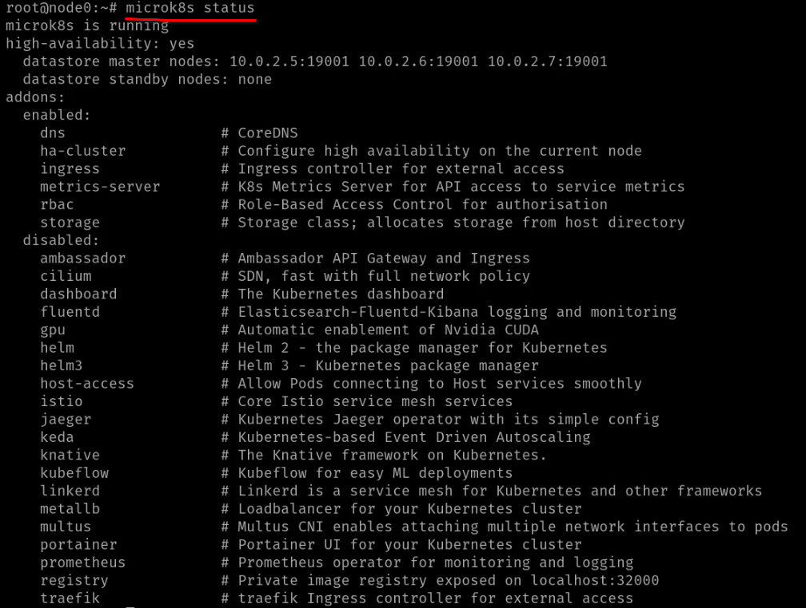
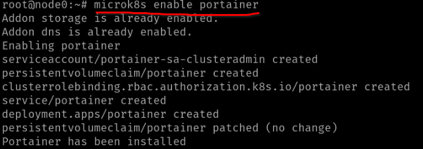
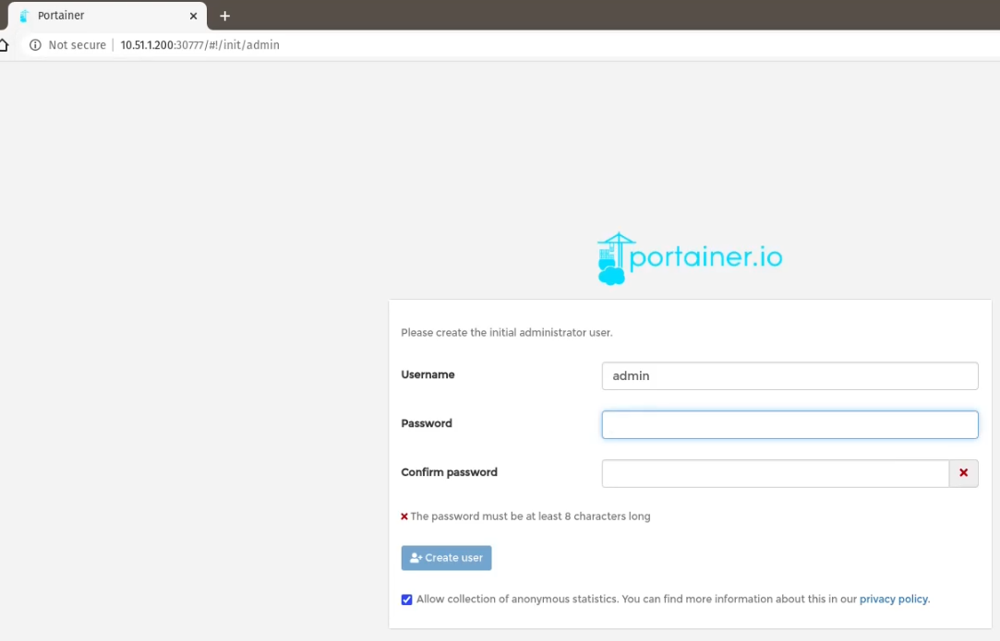
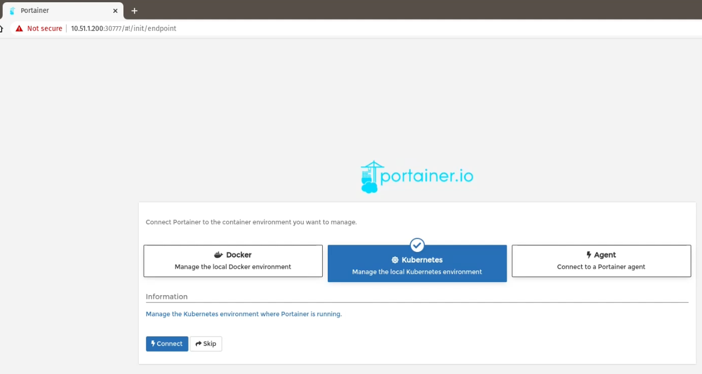
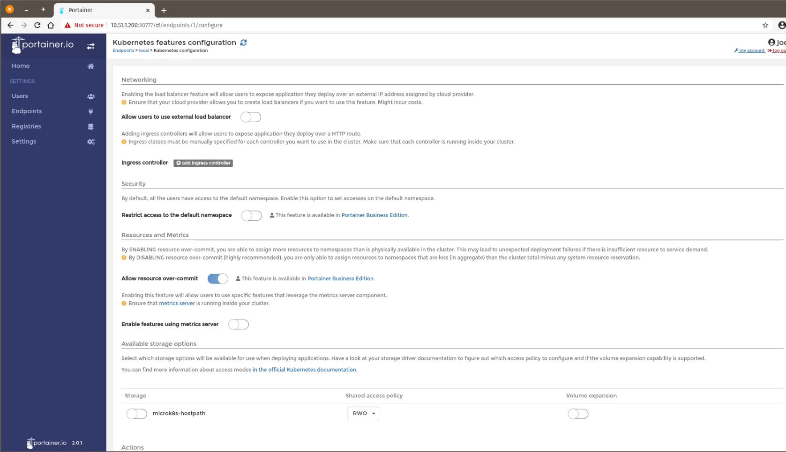
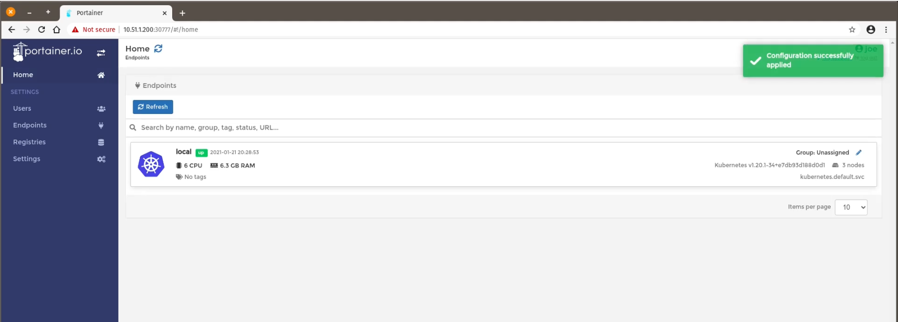

# What is Portainer

[Portainer](https://portainer.io) is an [open source](https://github.com/portainer/portainer) tool that lets users set-up, configure, and govern a container management portal that helps them get more value from Kubernetes sooner, with the skills the team already has. It also does the continuous deployment and delivery into Kubernetes and unorchestrated Docker, using the GitOps approach.

Manage any orchestrator, in the cloud, on prem, or at the edge, in a single interface.

## Install Portainer

Prerequisites:
- MicroK8s cluster
- Following addons enabled in MicroK8s:
  - dns
  - ha-cluster
  - ingress
  - metrics-server
  - rbac
  - storage

In order to check which addons are already enabled, run the following command:

```microk8s status.```

To enable any of addons, use:

```microk8s enable %ADDON_NAME%```

where `%ADDON_NAME%` could be `dns`, `ingress`, or anything you miss. 

You should see similar to this view. 



Now, to enable Portainer you should run a command:

```microk8s enable portainer```

It gives us the following output, indicating that required K8s resources have been created.




You can check the progress of the installation by running:

```kubectl get pods -n portainer```

It shouldn't take more than 25s to download, install and start. We can now switch to a web browser to load the Portainer interface. Please make note of the IP address of the machine that is running Portainer.

You can check the IP address on linux by running `ip a` or `ifconfig`.

Portainer for MicroK8s runs on port 30777 and in our case the IP address of the node running Portainter was 10.51.1.200 so in order to load the web interface we used http://10.51.1.200:30777 on our web browser.


Finally now we can finish installing Portainer on the web browser in 3 simple steps:

1. Create the initial adminstrator user and password (you can change the default admin to any other username):



2. Connect Portainer to the local Kubernetes environment:



3. The last step is to configure the Kubernetes features you would like to enable on your installation:



If the default ones are ok, you can simply click on Save configuration by scrolling down to the end:

You should see your local endpoint up and running with all the hardware resources recognized by Portainer:



**Congrats !** Portainer is up and running within MicroK8s cluster!

## Next steps

- Create more users in Portainer
- Deploy the application into Kubernetes using form
- Deploy the application into Kubernetes using K8s manifest stored in Git repo
- Connect OAuth engine

## Tutorials

- [  How to Deploy Portainer on MicroK8s](https://www.portainer.io/blog/how-to-deploy-portainer-on-microk8s)
- [  How-to: Deploy Portainer on MicroK8s](https://www.youtube.com/watch?v=XYcKmPi4McA)  
- [ Portainer documentation](https://docs.portainer.io/)
