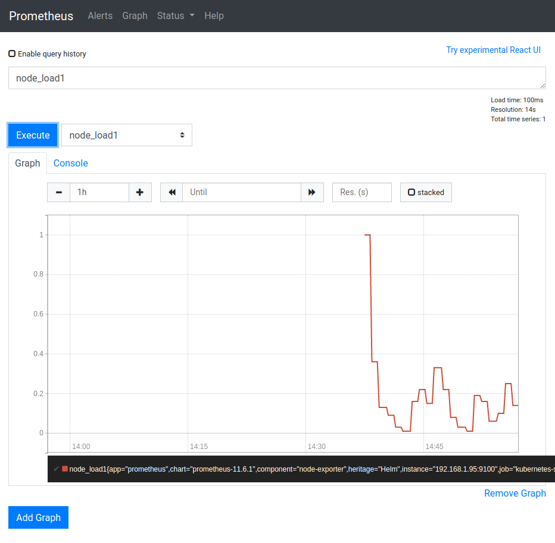

# Prometheus

What is prometheus ? From the
[ Prometheus docs](https://prometheus.io/docs/introduction/overview/) :  

> Prometheus is an open-source systems monitoring and alerting toolkit originally built at SoundCloud. Since its inception in 2012, many companies and organizations have adopted Prometheus, and the project has a very active developer and user community.

Prometheus architecture (from their website):

[](https://prometheus.io/docs/introduction/overview/)

In this tutorial we use prometheus and its time-series data storage for collecting 
data and preparing its visualisation (with Grafana).

## Preparation

Prerequisites are: 
- [ Helm](helm.md)
- A storage provisioner to fullfill storage claims (e.g. 
[ NFS Storage](nfs.md))


## Installation

For installation we will use the
[  stable/prometheus](https://github.com/helm/charts/tree/master/stable/prometheus)
chart. It offers lots of options but for now we focus on the server component and disable
the pushgateway and the alertmanager. The important setting is

- server.persistentVolume.storageClass=**managed-nfs-storage**  
StorageClass name must match existing storage provisioner settings

```bash
kubectl create namespace prometheus
helm install prometheus -n prometheus --version=11.6.1 \
--set alertmanager.enabled=false \
--set pushgateway.enabled=false \
--set server.persistentVolume.storageClass=managed-nfs-storage \
stable/prometheus
```
Output:
```text
NAME: prometheus
LAST DEPLOYED: Wed Jul  8 16:37:02 2020
NAMESPACE: prometheus
STATUS: deployed
REVISION: 1
TEST SUITE: None
NOTES:
The Prometheus server can be accessed via port 80 on the following DNS name from within your cluster:
prometheus-server.prometheus.svc.cluster.local


Get the Prometheus server URL by running these commands in the same shell:
  export POD_NAME=$(kubectl get pods --namespace prometheus -l "app=prometheus,component=server" -o jsonpath="{.items[0].metadata.name}")
  kubectl --namespace prometheus port-forward $POD_NAME 9090


#################################################################################
######   WARNING: Pod Security Policy has been moved to a global property.  #####
######            use .Values.podSecurityPolicy.enabled with pod-based      #####
######            annotations                                               #####
######            (e.g. .Values.nodeExporter.podSecurityPolicy.annotations) #####
#################################################################################

For more information on running Prometheus, visit:
https://prometheus.io/
```

**IMPORTANT**
From the output we need to remember the servers url as we later need this for configuration of
the datasource of the Grafana dashboard:  
**prometheus-server.prometheus.svc.cluster.local**

## Testing 
Following the output instructions we can test our installation. Note the appending `--address=0.0.0.0`
which may be necessary in some local installations.
```bash
export POD_NAME=$(kubectl get pods --namespace prometheus -l "app=prometheus,component=server" -o jsonpath="{.items[0].metadata.name}")
kubectl --namespace prometheus port-forward $POD_NAME 9090 --address=0.0.0.0
```
Now open a browser on **http://192.168.1.100:9090** and explore prometheus native web interface.



## Cleanup

In case you want to remove the installation (e.g. reinstall ....)

```bash
helm uninstall prometheus --namespace=prometheus
kubectl delete namespace prometheus
helm list --all-namespaces
```

## Next steps

Next install the 
[ Grafana dashboard](grafana.md) 
to visualize all those metrics scraped by prometheus.

## Tutorials

 - [  
21:31 How Prometheus Monitoring works](https://www.youtube.com/watch?v=h4Sl21AKiDg)  
 Prometheus Architecture explained 
 [[Techworld with Nana](https://www.youtube.com/channel/UCdngmbVKX1Tgre699-XLlUA)]   
 - [  34:09 Prometheus monitoring for Kubernetes Cluster and Grafana visualization](https://www.youtube.com/watch?v=CmPdyvgmw-A)  
 [[Just me and Opensource](https://www.youtube.com/channel/UC6VkhPuCCwR_kG0GExjoozg)] 
