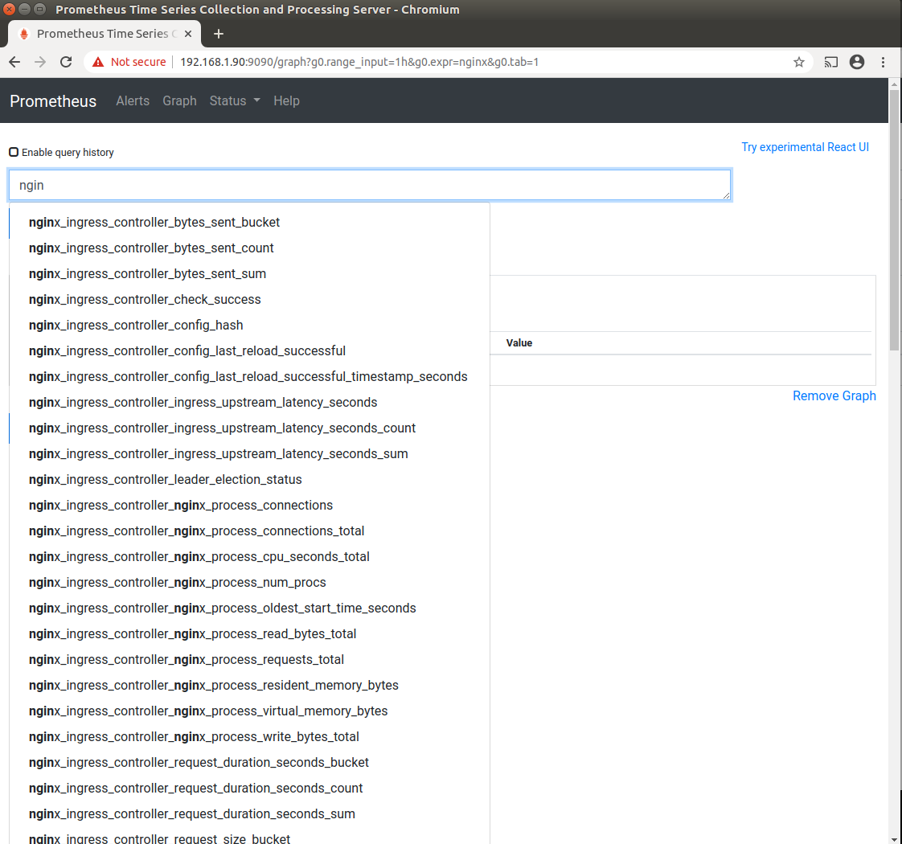
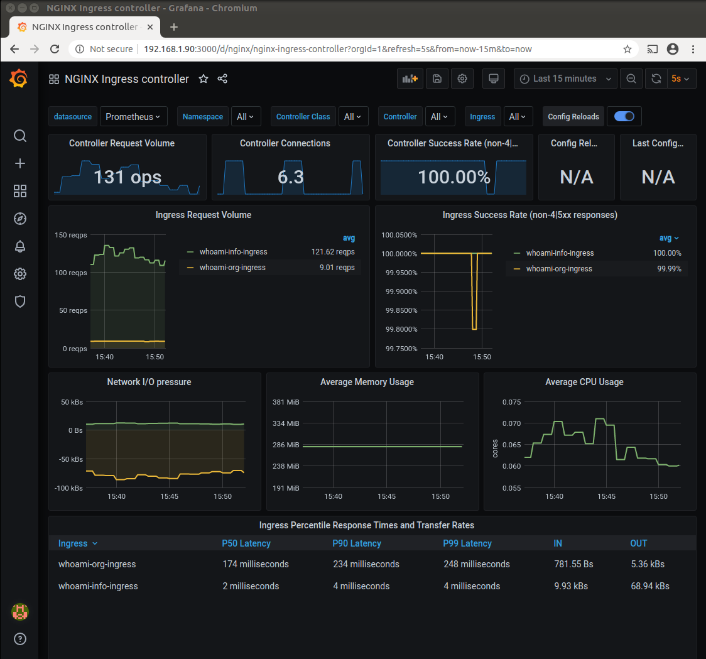
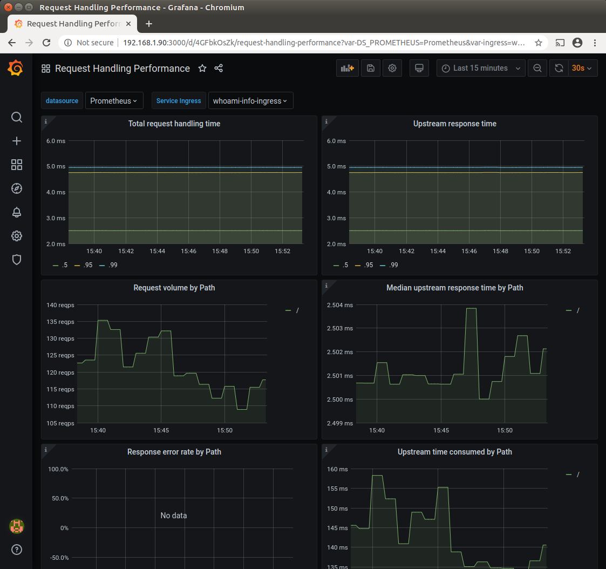

# Workload testing

Test your installations response times and payload stability
  
## Preparation

Prerequisites are: 
- [ Ingress](ingress.md)
- [ Prometheus](prometheus.md)
- [ Grafana](grafana.md)

```bash
cd ~/homekube/src/test/workload 
```

Now lets explore our installed instrumentation with some simple tests. There are plenty of 'hello-world'
containers available and for our tests it should be configurable to simulate different load conditions
and response times. This one [ containous/whoami](https://hub.docker.com/r/containous/whoami)
returns the request header and also can be easily parametrized for a delayed response `/?wait=50ms` or
to add some payload to the response `/data?size=10000`

## Installation

```bash
kubectl create namespace test-workload
kubectl create deployment whoami --image=containous/whoami -n test-workload
kubectl expose deployment whoami --type=NodePort --port=80 -n test-workload
kubectl get service whoami -n test-workload
```

In the `test-workload` namespace we deploy the container and expose it as a service. Note that 
`--type=NodePort` allows us to test the installed container directly e.g. not just via ingress so to confirm
that it is properly installed.

```test
NAME     TYPE       CLUSTER-IP      EXTERNAL-IP   PORT(S)        AGE
whoami   NodePort   10.152.183.34   <none>        80:32601/TCP   161m
```
The response from `kubectl get service whoami -n test-workload` 
shows us the exposed NodePort - in this example `32601`.

Now execute from a **local terminal**  
```bash
curl 192.168.1.100:32601
```

and the response should be like
```text
Hostname: whoami-589c447684-wwf2j
IP: 127.0.0.1
IP: ::1
IP: 10.1.88.35
IP: fe80::98e3:ceff:feed:3be6
RemoteAddr: 10.1.88.1:41338
GET / HTTP/1.1
Host: 192.168.1.100:32601
User-Agent: curl/7.58.0
Accept: */*
```

Ok, the testing container is properly working so as the next step we will expose it as an ingress. 
```bash
kubectl apply -f whoami-ingress.yaml
```
Actually we are exposing it twice under the host addresses `who-am-i.org` and `who-am-i.info` so we can put
different workloads on both addresses and watch the differences in Grafana. Its important to note
that **Ingress**es **must** be configured in **the same namespace** hence the namespace `test-workload` must
be defined in the definition file.  
Now lets check if the ingress works. We need to direct our request now to the Ingress which is available
through the public ip assigned to our MetalLb (see [ Ingress config](ingress.md)).

From a local terminal
```bash
curl -X GET 192.168.1.200 -H 'host: who-am-i.info'
```
```test
Hostname: whoami-589c447684-wwf2j
IP: 127.0.0.1
IP: ::1
IP: 10.1.88.35
IP: fe80::98e3:ceff:feed:3be6
RemoteAddr: 10.1.88.11:59460
GET / HTTP/1.1
Host: who-am-i.org
User-Agent: curl/7.58.0
Accept: */*
X-Forwarded-For: 10.1.88.1
X-Forwarded-Host: who-am-i.info
X-Forwarded-Port: 80
X-Forwarded-Proto: http
X-Real-Ip: 10.1.88.1
X-Request-Id: dfa50b04b25b9ab10c398275f3a74db0
X-Scheme: http
```

### Testing

#### Check proper scraping
Next lets make sure that prometheus is actually scraping all the required metrics.
Open the [ Prometheus ui](prometheus.md#testing) 
and when searching for nginx metrics it should look like this



There should be a long list metrics being exposed including some containing the words `"bucket"`.
Unfortunately there are a couple of issues that might have been gone wrong:
- If you don't see any nginx metrics at all then nginx controller is possibly not configured for scraping.
We have done that already previously during
[ Ingress config](ingress.md)
- If you only see some metrics e.g. no metrics containing `"bucket"` then Prometheus probably needs to be reinstalled.
Prometheus configuration omits some important nginx metrics in case 
it does not find any Ingress host configuration during installation. That may actually
be the case when following all the installation steps in the recommended order because
now for the first time we have configured an ingress host address (`who-am-i.org` and `who-am-i.info`).
In this case just do a `helm uninstall ...` and `helm install ...` again following
the [ Prometheus instructions](prometheus.md).

#### Providing testloads

We provide 2 testloads one for each of the configured endpoints. Open two **local terminals** and execute 
```bash
while true; do curl -X GET 192.168.1.200/?wait=10ms -H 'host: who-am-i.info'; done
```
We are requesting the `who-am-i.info` host with with a given latency of ~10ms.  
In the other terminal execute the request for host `who-am-i.org` with a latency of ~100ms.

```bash
while true; do curl -X GET 192.168.1.200/?wait=100ms -H 'host: who-am-i.org'; done
```

#### Explore Grafana

If not done already you'll need to expose Grafana as a service e.g. using port-forwarding.

In the upper bar in Grafana select the `NGINX Ingress controller` dashboard.
Thats the primary nginx dashboard as it is defined by the `nginx.json` on the
[  Nginx dashboards](https://github.com/kubernetes/ingress-nginx/tree/master/deploy/grafana/dashboards)
page. You see the different workloads for both Ingress. In the lower dashboard section there are 3 different percentiles visible.
The `P50 Latency` e.g. shows the latency for 50% of the requests. In the `Ingress Request Volume` we see the
different `Request per second` **reqps** rates.



The next screenshot shows `Request Handling performance` dashboard with `whoami-info-ingress` service selected.
This dashboard is defined by the `request-handling-performance.json` on the
[  Nginx dashboards](https://github.com/kubernetes/ingress-nginx/tree/master/deploy/grafana/dashboards)
page  with some minor modifications. We replaced the time-period occurrences `[1m]` with a longer period `[2m]` because 
the original settings did not provision the view reliably and instead showed the `no data` markers.


This screenshot shows the same dashboard again but with `whoami-org-ingress` service selected. Note the different volume and
time period scales as expected from the different workloads.



Now lets change the workload to ~100kb and see if our dashboards will reflect the changes
```bash
while true; do curl -X GET 192.168.1.200/data?size=100000 -H 'host: who-am-i.org'; done
```


The screenshot shows that the `Average response size by path` rose to ~100kb - thats exactly the expected amount. 